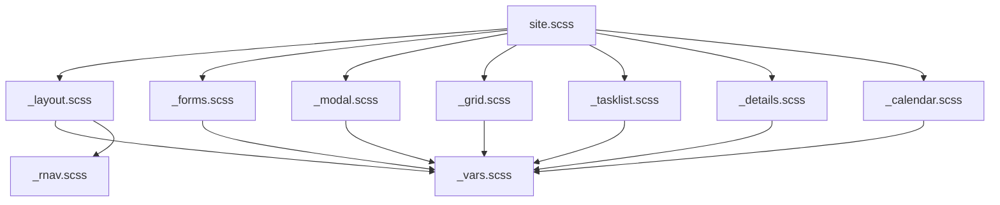

# Analýza HTML/CSS/JS přístupu projektu Altairis ReP
## Rešerše a obecné instrukce

> **Projekt:** [vasekNaus/ReP](https://github.com/vasekNaus/ReP) — ASP.NET Core 10 Razor Pages, rezervační systém  
> **Analýza provedena:** 2026-05-26

---

## Executive Summary

Projekt ReP používá **zcela vlastní, frameworkově nezávislý CSS přístup** postavený na SCSS (kompilovaný přes Visual Studio Web Compiler). Není zde žádný Bootstrap, Tailwind ani jiný CSS framework — veškerý vizuál vznikl ručně z přibližně 14 KB kompilovaného CSS. HTML je psáno sémanticky dle HTML5 standardů, JavaScript je záměrně minimální (cca 50 řádků vanilla JS). Celá architektura demonstruje, že moderní, responzivní a funkční webová aplikace může být vytvořena bez těžkých frameworků, s jasnou strukturou a čistým kódem.

---

## 1. Přehled architektury

### 1.1 Frontend stack

| Vrstva | Technologie | Poznámka |
|--------|------------|---------|
| HTML templating | Razor Pages (CSHTML) | ASP.NET Core 10 |
| CSS | Vlastní SCSS → site.min.css | Žádný framework |
| JavaScript | Vanilla JS (site.js ~50 řádků) | Žádný framework |
| Ikony | Font Awesome 6.7.1 (CDN) | |
| Vlajky | flag-icons 7.2.3 (CDN) | Pro jazykový přepínač |
| Validace | aspnet-client-validation 0.11.0 (CDN) | |
| Build nástroj | Visual Studio Web Compiler | SCSS → CSS kompilace |

### 1.2 Architektura SCSS souborů

```
site.scss  (entry point)
├── _layout.scss      ← html/body/header/nav/footer + utility třídy
│   ├── _vars.scss    ← design tokeny (barvy, font, breakpointy)
│   └── _rnav.scss    ← mixin pro responzivní navigaci
├── _forms.scss       ← formuláře, buttony, validace
│   └── _vars.scss
├── _modal.scss       ← CSS-only modální dialogy
│   └── _vars.scss
├── _grid.scss        ← table.grid komponenta
│   └── _vars.scss
├── _tasklist.scss    ← ul.tasklist komponenta
│   └── _vars.scss
├── _details.scss     ← table.details komponenta
│   └── _vars.scss
└── _calendar.scss    ← kalendářový layout
    └── _vars.scss
```



### 1.3 HTML struktura stránky

```
html[lang=cs]
└── head
│   ├── title
│   ├── meta[viewport]
│   ├── link[Font Awesome CDN]
│   ├── link[flag-icons CDN]
│   ├── link[site.min.css]  ← konfigurovatelný
│   └── link[manifest.webmanifest]
└── body
    ├── header      ← logo + jazykový přepínač
    ├── nav         ← checkbox hamburger nav
    ├── main
    │   ├── h1      ← titulek stránky (z ViewBag.Title)
    │   └── @RenderBody()
    ├── footer      ← copyright, loga
    └── scripts
        ├── aspnet-client-validation (CDN)
        └── site.js
```

---

## 2. Klíčové techniky a vzory

### 2.1 Design Tokeny (`_vars.scss`)

Celý vizuální styl je postaven na **7 proměnných** [^1]:

```scss
$Black: #000;
$White: #fff;
$Accent: #ff6a00;           // Oranžová brandová barva

$FontFamily: Segoe UI, Arial, Helvetica, sans-serif;

$Padding: 20px;
$StopMax: 1000px;           // Max šířka obsahu
$StopMin: 900px;            // Mobilní breakpoint
```

**Klíčový princip:** Accent barva se používá v celé aplikaci nejen jako plná barva, ale i jako průhledné vrstvy (`rgba($Accent, .1)`, `rgba($Accent, .5)`, `rgba($Accent, .75)`), čímž vzniká konzistentní paleta z jediné barvy.

### 2.2 SCSS Mixiny jako znovupoužitelné komponenty

Projekt definuje **3 hlavní mixiny** místo CSS tříd[^2][^3]:

**`@mixin rnav()`** — Parametrizovatelná responzivní navigace:
```scss
@mixin rnav($WidthStop: 40em, $Padding: .5em, $ItemSpacing: 2em,
            $Color: #fff, $BackColor: #000, $HoverColor: #fd0,
            $HoverBackColor: #333, $WideAlign: center, $NarrowAlign: left) {
    // ... implementace
}
```

**`@mixin button`** — Styl tlačítka (používán i pro `<a>` a `<input type="submit">`):
```scss
@mixin button {
    display: inline-block;
    font-weight: bold;
    border: 1px solid $Black;
    background-color: $Accent;
    color: $White;
    min-width: 20ex;
    // responsive: na mobilu 100% šířka
}
```

**`@mixin textbox`** — Styl textových vstupů:
```scss
@mixin textbox {
    font-family: $FontFamily;
    width: 100%;
    border: 1px solid lighten($Black, 50);
    // validační stav:
    &.input-validation-error {
        background-color: rgba($Accent, .05);
        border: 2px solid $Accent;
    }
}
```

### 2.3 Checkbox Hack pro responsivní navigaci (bez JS)[^4]

Hamburger menu je implementováno **čistě v CSS** pomocí neviditelného `<input type="checkbox">`:

```html
<input type="checkbox" id="mtoggler" hidden="hidden" />
<label for="mtoggler" class="open" hidden="hidden"><span>☰</span></label>
<label for="mtoggler" class="close" hidden="hidden"><span>🗙</span></label>
<ul>
  <!-- navigační položky -->
</ul>
```

```scss
input[type=checkbox] {
    position: absolute; left: -9999em;  // vizuálně skrytý ale funkční
    
    ~ label { display: none; }  // labely skryty na desktopu
    
    &:checked {
        ~ label.open  { display: none; }
        ~ label.close { display: block; }
        ~ ul          { display: block; }  // menu se zobrazí
    }
}
@media (max-width: $StopMin) {
    ul { display: none; }  // na mobilu skryto
    ~ label.open { display: block; }  // hamburger ikonka viditelná
}
```

### 2.4 CSS `:target` Trick pro modální dialogy (bez JS)[^5]

Modály jsou implementovány **bez Javascriptu** pomocí CSS pseudotřídy `:target`:

```html
<!-- Odkaz otevírající modál -->
<a href="#confirmDelete">Smazat</a>

<!-- Modál (standardně skrytý) -->
<div id="confirmDelete" class="modal">
    <article>
        <header>Potvrzení</header>
        <p>Opravdu smazat?</p>
        <footer>
            <a href="#" class="button">OK</a>  <!-- href="#" zavírá -->
        </footer>
    </article>
</div>
```

```scss
.modal {
    visibility: hidden;
    opacity: 0;
    position: absolute; top: 0; right: 0; bottom: 0; left: 0;
    display: flex; align-items: center; justify-content: center;
    background: rgba($Accent, .75);

    &:target {          // aktivuje se, když URL hash = ID elementu
        visibility: visible;
        opacity: 1;
    }
}
```

### 2.5 Pojmenování CSS tříd

Projekt používá **krátký, sémantický styl pojmenování** — ne BEM, ne Tailwind utility:

| Kategorie | Příklady | Princip |
|-----------|----------|---------|
| Zarovnání | `.l`, `.r`, `.c` | Jedno písmeno |
| Float | `.fl`, `.fr` | Zkratka |
| Komponenty | `table.grid`, `table.details`, `ul.tasklist` | Kombinace elementu + třídy |
| Modifikátory | `.secondary`, `.tertiary`, `.vertical`, `.tall` | Přídavné jméno |
| Stav | `.today`, `.weekend`, `.new`, `.current` | Přídavné jméno |
| Utility | `.infobox`, `.tag`, `.strong`, `.small`, `.em` | Sémantický název |

### 2.6 Sémantické HTML5 elementy[^6]

Projekt důsledně používá sémantické HTML5 elementy:

- `<header>`, `<nav>`, `<main>`, `<footer>` — globální struktura
- `<article>` — obsah v modálech a kalendáři
- `<section>` — týden v kalendáři (`section.week`)
- `<time>` — časové hodnoty s atributy
- `<fieldset>` + `<legend>` — skupiny formulářových polí
- `<details>` + `<summary>` — rozbalovací sekce

### 2.7 Kalendářový layout s CSS Flexbox[^7]

Responzivní měsíční kalendář je postaven výhradně na Flexboxu:

```scss
.calendar {
    @media (min-width: $ScreenStop) {
        display: flex;
        flex-direction: column;         // týdny pod sebou
    }
    
    section.week {
        @media (min-width: $ScreenStop) {
            display: flex;
            flex-direction: row;        // dny vedle sebe
        }
        
        > article {
            flex: 1;                    // rovnoměrné rozdělení
            min-height: 10em;
        }
    }
}
```

Na mobilu (pod `$ScreenStop`) se zobrazí lineárně, den za dnem.

### 2.8 Formulářové EditorTemplates[^8]

Formuláře využívají ASP.NET EditorTemplates systém — `@Html.EditorFor(m => m.Input)` automaticky renderuje celý formulář podle datového modelu:

```cshtml
// Object.cshtml - iteruje všechny vlastnosti modelu
foreach (var prop in ViewData.ModelMetadata.Properties.Where(m => m.ShowForEdit)) {
    if (prop.ModelType.Equals(typeof(Boolean))) {
        <p>@Html.Editor(prop.PropertyName) @Html.Label(prop.PropertyName)</p>
    } else {
        <p>
            @Html.Label(prop.PropertyName, prop.GetDisplayName() + ":")<br />
            <span class="description">@prop.Description</span>
            @Html.Editor(prop.PropertyName)
        </p>
    }
}
```

### 2.9 JavaScript — minimalistický přístup[^9]

`site.js` má **dvě zodpovědnosti**, ~50 řádků vanilla JS:

1. **Inicializace ASP.NET client-side validace:**
```javascript
var v = new aspnetValidation.ValidationService();
v.bootstrap();
```

2. **GET→POST konverze odkazů** (pro CSRF-bezpečné mazání):
```javascript
document.querySelectorAll('a[data-convert-to-post]').forEach(a => {
    a.addEventListener('click', e => {
        e.preventDefault();
        if (!confirm(a.getAttribute('data-post-confirm'))) return;
        
        // Vytvoří hidden form s CSRF tokenem a submitne
        const token = document.querySelector('input[name="__RequestVerificationToken"]');
        const form = document.createElement('form');
        form.method = 'post';
        form.action = a.getAttribute('href');
        form.innerHTML = token.outerHTML;
        document.body.appendChild(form);
        form.submit();
    });
});
```

Použití v HTML:
```html
<a data-convert-to-post="true" 
   data-post-confirm="Opravdu smazat?" 
   href="/delete/1">Smazat</a>
```

### 2.10 Konfigurovatelnost designu za runtime[^10]

Design aplikace je konfigurovatelný přes `appsettings.json` — výměna stylesheets bez změny kódu:

```json
{
  "Design": {
    "StylesheetUrl": "~/Content/Styles/site.min.css",
    "AdditionalStylesheetUrl": null,
    "HeaderImageUrl": "~/Content/Images/rep-logo.svg",
    "ApplicationName": "ReP",
    "CalendarEntryBgColor": "#090",
    "CalendarEntryFgColor": "#fff"
  }
}
```

---

## 3. Vzory HTML stránek

### 3.1 Standardní stránka se seznamem (Admin/Users/Index)
```cshtml
@{ this.ViewBag.Title = UI.Admin_Users_Index_Title; }

<table class="grid">
    <thead>
        <tr><th>...</th></tr>
    </thead>
    <tbody>
        <tr class="new">  <!-- řádek pro "přidat" -->
            <td colspan="N"><a asp-page="Create">Přidat</a></td>
        </tr>
        @foreach (var item in Model.Items) {
            <tr>
                <th scope="row"><a asp-page="Edit" asp-route-id="@item.Id">@item.Name</a></th>
                <td>@item.Description</td>
                <td class="buttons r"><!-- akční tlačítka --></td>
            </tr>
        }
    </tbody>
</table>

<modal-box id="created" message="..." />   <!-- feedback modál -->
```

### 3.2 Standardní formulářová stránka (Create/Edit)
```cshtml
@{ this.ViewBag.Title = "..."; }

<form method="post">
    @Html.EditorFor(m => this.Model.Input)    <!-- nebo ruční fieldy -->
    <footer>
        <div asp-validation-summary="All"></div>
        <input type="submit" value="@UI._Submit" />
        <a asp-page="Index" class="button secondary">@UI._Cancel</a>
        <!-- u Edit: delete tlačítko jako .tertiary -->
        <input type="submit" class="tertiary" value="@UI._Delete" 
               asp-page-handler="delete" 
               confirm-message="@UI.ConfirmDelete" />
    </footer>
</form>
```

### 3.3 Stránka s modálním dialogem

```html
<!-- Trigger link -->
<a href="#myModal" class="button">Otevřít dialog</a>

<!-- Modal -->
<div id="myModal" class="modal">
    <article class="l">
        <header>Titulek</header>
        <p>Obsah</p>
        <footer>
            <a href="#" class="button">OK</a>
            <a href="#" class="button secondary">Zrušit</a>
        </footer>
    </article>
</div>
```

### 3.4 Vzor s tlačítky

```html
<!-- Horní panel s tlačítky -->
<p class="buttons">
    <a href="#action1" class="button">Hlavní akce</a>
    <a asp-page="Other" class="button secondary">Vedlejší akce</a>
    <span class="fr">
        <!-- tlačítka doprava -->
        <a class="button secondary" style="min-width:3ex">◄</a>
        <a class="button secondary" style="min-width:3ex">►</a>
    </span>
</p>
```

---

## 4. Obecné instrukce pro HTML/CSS/JS

Na základě analýzy projektu ReP lze extrahovat tyto obecné principy:

---

### 📐 HTML Instrukce

**[H1] Používejte sémantické HTML5 elementy**
- `<header>`, `<nav>`, `<main>`, `<footer>` pro globální strukturu stránky
- `<article>` pro samostatné obsahové celky (karty, modály, príspěvky)
- `<section>` pro tematické skupiny obsahu
- `<time datetime="...">` pro data a časy
- `<fieldset>` + `<legend>` pro skupiny formulářových polí

**[H2] Každá stránka musí mít jeden `<h1>`**
- `<h1>` vždy odpovídá titulku stránky (v ReP z `ViewBag.Title`)
- Ostatní nadpisy `<h2>`, `<h3>` hierarchicky pod ním

**[H3] Modální dialogy implementujte přes CSS `:target`**
- `<div id="uniqueId" class="modal">` — standardně skrytý
- Odkaz `<a href="#uniqueId">` otevře modal změnou URL hash
- Zavření: `<a href="#">` resetuje hash → modal se skryje
- Nevyžaduje JavaScript

**[H4] Hamburgr menu implementujte checkbox hackem**
- Neviditelný `<input type="checkbox" id="toggle">` mimo obrazovku
- `<label for="toggle">` jako klikatelný button
- CSS `input:checked ~ nav { display: block; }` toggle menu

**[H5] GET→POST konverzi odkazů řešte data atributy**
- `data-convert-to-post="true"` — marker pro JS konverzi
- `data-post-confirm="Zpráva"` — potvrzovací dialog
- JavaScript vloží CSRF token a submittne form
- Zachová sémantiku odkazu v HTML, bezpečnost v JS

**[H6] Formuláře strukturujte `<p>` odstavci**
```html
<form>
    <p>
        <label for="name">Jméno:</label><br>
        <input type="text" id="name" name="name">
        <span class="description">Volitelný popis pole</span>
    </p>
    <footer>
        <button type="submit">Uložit</button>
        <a href="/cancel" class="button secondary">Zrušit</a>
    </footer>
</form>
```

**[H7] Tabulky používejte správně**
- `<thead>` s `<th scope="col">` pro hlavičky sloupců
- `<th scope="row">` pro identifikační sloupec v `<tbody>`
- `<tfoot>` pro sumarizační řádky nebo akční `<td>`
- `class="buttons r"` pro buňku s akčními tlačítky (zarovnaná vpravo)

**[H8] Ikony Font Awesome vkládejte s `fa-fw` a `aria`**
```html
<i class="fa-solid fa-fw fa-user" title="Uživatel"></i>
```
- `fa-fw` pro fixní šířku (zarovnání v navigaci)
- `title` atribut pro přístupnost

---

### 🎨 CSS / SCSS Instrukce

**[C1] Definujte design tokeny jako SCSS proměnné**
```scss
$Accent: #ff6a00;       // Jedna brandová barva
$Black: #000;
$White: #fff;
$FontFamily: Segoe UI, Arial, sans-serif;
$Padding: 20px;         // Základní spacing jednotka
$StopMax: 1000px;       // Max šířka layoutu
$StopMin: 900px;        // Mobilní breakpoint
```
- Jediný soubor `_vars.scss` importovaný všemi parcialy
- Accent barva stačí jedna — derivujte `rgba($Accent, .1/.5/.75)` pro variace

**[C2] Jeden soubor, jedna zodpovědnost (SCSS parcials)**
- `_vars.scss` — pouze proměnné
- `_layout.scss` — globální layout HTML elementů
- `_rnav.scss` — pouze navigace
- `_forms.scss` — pouze formuláře
- `_modal.scss` — pouze modály
- `_calendar.scss` — pouze kalendář
- `site.scss` — pouze importy

**[C3] Opakující se vzory zabalte do `@mixin`**
- Button styl: `@mixin button` → použití na `<button>`, `<input type="submit">`, `<a>`
- Input styl: `@mixin textbox` → použití na všechny textové vstupy
- Navigace: `@mixin rnav($params...)` → parametrizovaný, znovupoužitelný

**[C4] Nepište media queries izolovaně — pište je u komponenty**
```scss
.modal article {
    max-width: 50%;

    @media (max-width: $StopMin) {
        max-width: 95%;  // ← hned vedle wide stylu
    }
}
```

**[C5] Globální layout: `html` + `body` jako kontejner**
```scss
html {
    background-color: $Accent;  // Oranžová na okrajích stránky

    body {
        max-width: $StopMax;
        background-color: $White;
        margin: $Padding auto;    // centrování
        padding: $Padding;
    }
}
```
Na mobilu odstraníme margin (`margin: 0 auto`) — stránka je full-width.

**[C6] Komponenty jako kombinace element + třída**
```css
table.grid    { /* data tabulka */ }
table.details { /* detail view */ }
ul.tasklist   { /* task list */ }
ul.checkbox-list { /* checkbox skupina */ }
```
Výhoda: třída `grid` nemá vliv na jiné elementy než `<table>`.

**[C7] Krátké utility třídy pro layout**
- `.l`, `.r`, `.c` — zarovnání textu
- `.fl`, `.fr` — float left/right
- `.strong`, `.small`, `.em` — typografické modifikace
- Vyhnout se prefixování (ne `.text-left`, ale `.l`) — projekt to záměrně zkracuje

**[C8] Barvy přes `rgba()` pro konzistenci**
```scss
// Místo definování nových barev používejte průhlednosti accent barvy:
background-color: rgba($Accent, .1);   // Velmi jemný tint
background-color: rgba($Accent, .5);   // Polotransparentní
background-color: rgba($Accent, .75);  // Téměř plná overlay
border: 1px solid rgba($Accent, .25);  // Jemná border
```

**[C9] Tlačítka mají 3 varianty**
```scss
.button            { background: $Accent; }            // Primární
.button.secondary  { background: rgba($Accent, .5); }  // Vedlejší
.button.tertiary   { background: $White; float: right; } // Destruktivní (Delete)
```

**[C10] Formulářová validace přes CSS třídy**
```scss
.input-validation-error {
    background-color: rgba($Accent, .05);
    border: 2px solid $Accent;
}
.validation-summary-valid   { display: none; }
.validation-summary-errors  {
    border: 2px solid $Accent;
    color: $Accent;
    font-weight: bold;
}
```

**[C11] Kalendář: flex layout pro tabulkové data**
```scss
.calendar {
    display: flex; flex-direction: column;  // týdny pod sebou
    section.week {
        display: flex; flex-direction: row;  // dny vedle sebe
        article { flex: 1; }                 // rovnoměrné rozdělení
    }
}
// Na mobilu: bez flex = lineární řazení
```

**[C12] Ikonové seznamy s Font Awesome**
```html
<ul class="fa-ul">
    <li>
        <span class="fa-li"><i class="fa-solid fa-paperclip"></i></span>
        Obsah položky
    </li>
</ul>
```

---

### ⚡ JavaScript Instrukce

**[J1] JavaScript jako poslední resort — CSS řeší maximum**
- Hamburger menu → CSS checkbox hack
- Modální dialogy → CSS `:target`
- Tlačítka jako `<a>` → CSS styling
- JavaScript jen pro: GET→POST konverzi (CSRF bezpečnost) a inicializaci validace

**[J2] Data atributy jako HTML→JS rozhraní**
```html
<a data-convert-to-post="true"
   data-post-confirm="Opravdu smazat?"
   href="/delete/42">Smazat</a>
```
```javascript
// JS čte data atributy
const confirm_msg = a.getAttribute('data-post-confirm');
const url = a.getAttribute('href');
```
- Čistá separace: HTML deklaruje záměr, JS implementuje chování
- Žádné `onclick` atributy v HTML

**[J3] CSRF token vždy injektujte do dynamicky vytvářených formů**
```javascript
const token = document.querySelector('input[name="__RequestVerificationToken"]');
form.innerHTML = token.outerHTML;  // CSRF token musí být v každém POST
```

**[J4] Inicializace JS přes CDN knihovny, ne vlastní kód**
- Validace: CDN `aspnet-client-validation` → `new ValidationService().bootstrap()`
- Vlastní kód jen pro business logiku aplikace
- Žádný webpack, žádný bundler — přímé CDN URL s `integrity` hash

**[J5] Vanilla JS pro DOM manipulaci**
```javascript
// Preferujte:
document.querySelectorAll('a[data-convert-to-post]').forEach(a => {
    a.addEventListener('click', e => { ... });
});

// Místo jQuery:
$('a[data-convert-to-post]').on('click', function(e) { ... });
```

**[J6] Minimální JS footprint**
- Celý custom JS: ~50 řádků v jediném souboru
- Žádné importy, žádné moduly, žádné třídy
- Načtení na konci `<body>`, po obsahu stránky
- `@RenderSection("scripts", required: false)` pro stránky vyžadující extra JS

---

## 5. Shrnutí filozofie projektu

```
"Dělej méně, ale lépe."
```

| Princip | Implementace |
|---------|-------------|
| **Bez CSS frameworků** | Vlastní 14 KB CSS je snazší udržovat než 300 KB Bootstrap |
| **CSS > JavaScript** | Modály a menu fungují bez JS přes `:target` a checkbox hack |
| **Sémantický HTML** | Každý element má správný tag, ne jen `<div class="...">` |
| **Jedna brandová barva** | `$Accent: #ff6a00` + průhlednosti = celá paleta |
| **Konfigurovatelnost** | `appsettings.json` mění celý design bez změny kódu |
| **Minimální dependencies** | 3 CDN knihovny, žádný npm, žádný bundler |
| **Komponenty přes mixiny** | SCSS mixin > CSS třída pro opakující se vzory |
| **Mobile-first breakpoint** | Jediný breakpoint `$StopMin: 900px`, dostatečný |
| **EditorTemplates** | Generování formulářů z datového modelu = DRY HTML |

---

## Confidence Assessment

| Oblast | Jistota | Poznámka |
|--------|---------|---------|
| SCSS architektura | ✅ Vysoká | Všechny soubory přečteny kompletně |
| HTML vzory | ✅ Vysoká | 10+ stránek analyzováno |
| JavaScript | ✅ Vysoká | Jediný JS soubor přečten kompletně |
| Design záměry | 🔶 Střední | Inferováno z kódu, bez dokumentace autora |
| EditorTemplates | ✅ Vysoká | 7 klíčových templates přečteno |
| Customizace | ✅ Vysoká | AppSettings.cs konfigurace ověřena |

---

## Footnotes

[^1]: [_vars.scss](https://github.com/vasekNaus/ReP/blob/master/Altairis.ReP.Web/wwwroot/Content/Styles/_vars.scss) — SHA `6d4dc2d79416b20b90512e77ed1494328ba9566d`

[^2]: [_rnav.scss](https://github.com/vasekNaus/ReP/blob/master/Altairis.ReP.Web/wwwroot/Content/Styles/_rnav.scss) — SHA `c38de26fd7cc87ab679e144a62d410e2ce36534e`

[^3]: [_forms.scss](https://github.com/vasekNaus/ReP/blob/master/Altairis.ReP.Web/wwwroot/Content/Styles/_forms.scss) — SHA `56b9f8b4a5d83c5f46885297ef3d83c8c6d77a04`

[^4]: [_layout.scss:nav section](https://github.com/vasekNaus/ReP/blob/master/Altairis.ReP.Web/wwwroot/Content/Styles/_layout.scss) + [_Layout.cshtml:nav](https://github.com/vasekNaus/ReP/blob/master/Altairis.ReP.Web/Pages/Shared/_Layout.cshtml)

[^5]: [_modal.scss](https://github.com/vasekNaus/ReP/blob/master/Altairis.ReP.Web/wwwroot/Content/Styles/_modal.scss)

[^6]: [_Layout.cshtml](https://github.com/vasekNaus/ReP/blob/master/Altairis.ReP.Web/Pages/Shared/_Layout.cshtml)

[^7]: [_calendar.scss](https://github.com/vasekNaus/ReP/blob/master/Altairis.ReP.Web/wwwroot/Content/Styles/_calendar.scss)

[^8]: [Pages/EditorTemplates/Object.cshtml](https://github.com/vasekNaus/ReP/blob/master/Altairis.ReP.Web/Pages/EditorTemplates/Object.cshtml)

[^9]: [wwwroot/Content/Scripts/site.js](https://github.com/vasekNaus/ReP/blob/master/Altairis.ReP.Web/wwwroot/Content/Scripts/site.js)

[^10]: Altairis.ReP.Web AppSettings Design konfigurace (inferováno z `_Layout.cshtml` usage `this.OptionsAccessor.Value.Design.*`)
