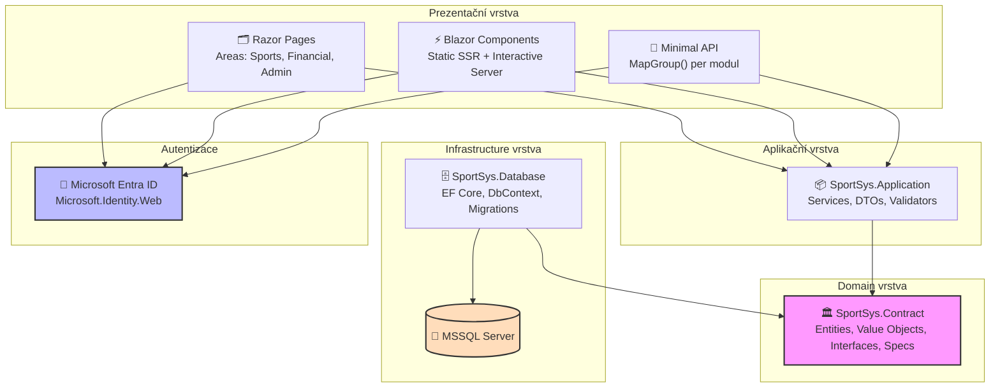

# Rešerše: Struktura webového projektu SportSys (ASP.NET Core)

> **Datum:** 14. 5. 2026  
> **Projekt:** `vasekNaus/HoSys` – hokejový informační systém  
> **Technologický základ:** ASP.NET Core 10, Blazor Web App, Razor Pages, EF Core 10, MSSQL, Entra ID

---

## Shrnutí (Executive Summary)

Pro systém `SportSys` je doporučena **Clean Architecture (Onion Architecture)** se čtyřmi vrstvami (`Domain → Application → Database/Infrastructure → Web`). Prezentační vrstva (`SportSys.Web`) kombinuje **Razor Pages s Areas** pro jednoduché administrátorské stránky, **Blazor Web App** s per-stránkovými render módy pro interaktivní části a **Minimal API s MapGroup()** pro API endpointy. Projekt `SportSys.Database` zůstává jako infrastrukturní vrstva; přidají se projekty `SportSys.Contract` (business objekty) a `SportSys.Application` (aplikační služby). Autentizace bude realizována přes **Microsoft Entra ID** pomocí `Microsoft.Identity.Web`, s App Roles namapovanými na tři moduly (Sporty, Finance, Administrativa).

---

## 1. Architektura řešení — Clean Architecture

### 1.1 Proč Clean Architecture?

Microsoft ve svém oficiálním eBoooku explicitně popisuje evoluci od monolitické „All-in-One" struktury přes N-vrstvou architekturu až k Clean Architecture[^1]:

- **All-in-One** (nevhodné): Business logika roztroušená mezi `Models/`, `Services/` a `Controllers/`
- **Tradiční N-vrstvá** (problém): BLL závisí na DAL — compile-time závislost narušuje testovatelnost
- **Clean Architecture** (doporučeno): Dependency Inversion — Infrastructure závisí na Domain, ne naopak

Dva nejpopulárnější .NET šablony (`ardalis/CleanArchitecture` ~17k ⭐, `jasontaylordev/CleanArchitecture` ~16k ⭐) se shodují na stejném přístupu[^2][^3].

### 1.2 Navržená struktura solution

```
SportSys/                               ← Solution root
├── SportSys.slnx                       ← Solution soubor (nový XML formát)
├── Directory.Build.props               ← Sdílené MSBuild vlastnosti (TargetFramework, Nullable)
├── Directory.Packages.props            ← Central Package Management (CPM) — verze NuGet balíčků
├── global.json                         ← Připnutí verze SDK
├── .editorconfig                       ← Styl kódu
│
├── src/
│   ├── SportSys.Contract/              ← Vrstva 1: Contract (nejhlubší)
│   ├── SportSys.Application/           ← Vrstva 2: Application / Use Cases
│   ├── SportSys.Database/              ← Vrstva 3: Infrastructure / EF Core (EXISTUJE)
│   ├── SportSys.Web/                   ← Vrstva 4: Prezentace (Razor Pages + Blazor + API)
│   └── SportSys.Web.Client/            ← Vrstva 4b: Blazor WASM klient (pokud bude WASM)
│
└── tests/
    ├── SportSys.Contract.UnitTests/
    ├── SportSys.Application.UnitTests/
    └── SportSys.Database.IntegrationTests/
```

### 1.3 Pravidla závislostí

```
SportSys.Web
    │  závisí na
    ▼
SportSys.Application
    │  závisí na
    ▼
SportSys.Contract
    ▲
    │  implementuje rozhraní z Contract
SportSys.Database  ──závisí na──►  SportSys.Contract
```

**Klíčové pravidlo:** `SportSys.Web` NIKDY přímo nereferencuje `SportSys.Database`. Přístup k databázi je vždy zprostředkován přes rozhraní z `Contract` a jejich implementace v `Database`[^4].

---

## 2. Detail jednotlivých vrstev

### 2.1 SportSys.Contract — Business objekty (NOVÝ projekt)

Nejhlubší vrstva. **Nulová závislost na externích projektech.** Žádný EF Core, žádný HTTP.

**`.csproj` závislosti:**
```xml
<ItemGroup>
  <PackageReference Include="Ardalis.GuardClauses" Version="4.*" />
  <PackageReference Include="Ardalis.Result"       Version="8.*" />
  <PackageReference Include="Ardalis.Specification" Version="9.*" />
</ItemGroup>
```

**Struktura složek:**
```
SportSys.Contract/
├── Interfaces/
│   ├── IRepository.cs          ← generický write repozitář (rozhraní)
│   ├── IReadRepository.cs      ← generický read-only repozitář (rozhraní)
│   └── IAggregateRoot.cs       ← marker interface — omezení pro IRepository<T>
│
├── Aggregates/
│   ├── MatchAggregate/
│   │   ├── Match.cs            ← BOHATÝ domain entity (NOT EF entita!)
│   │   ├── MatchResult.cs      ← Value object (góly:góly)
│   │   └── Specifications/
│   │       ├── MatchBySeasonSpec.cs
│   │       └── MatchWithResultSpec.cs
│   ├── TrainingAggregate/
│   │   ├── Training.cs
│   │   └── Specifications/
│   ├── InvoiceAggregate/
│   │   ├── Invoice.cs
│   │   └── InvoiceItem.cs
│   └── PlayerAggregate/
│       └── Player.cs
│
├── ValueObjects/
│   └── SeasonCategory.cs
│
└── Services/
    └── IMatchResultService.cs  ← domain service interface (komplexní logika)
```

**Co sem patří:**
- ✅ Entity (business model třídy, které se persistují)
- ✅ Aggregate roots a jejich child entity
- ✅ Value Objects (immutabilní, rovnost hodnotou, ne identitou)
- ✅ Domain výjimky (`NotFoundException`, `BusinessRuleException`)
- ✅ Specifications (zapouzdření query logiky — Ardalis.Specification)
- ✅ Rozhraní pro repozitáře a domain services
- ❌ Žádný EF Core, žádný HTTP, žádné externí závislosti

**Příklad rozhraní (pattern z eShopOnWeb[^5]):**
```csharp
// SportSys.Contract/Interfaces/IRepository.cs
using Ardalis.Specification;

public interface IRepository<T> : IRepositoryBase<T> 
    where T : class, IAggregateRoot { }

public interface IReadRepository<T> : IReadRepositoryBase<T> 
    where T : class, IAggregateRoot { }

public interface IAggregateRoot { } // marker interface
```

**Příklad bohaté domain entity:**
```csharp
// SportSys.Contract/Aggregates/MatchAggregate/Match.cs
public class Match : IAggregateRoot
{
    public int Id { get; private set; }
    public int SeasonId { get; private set; }
    public string SeasonCategoryName { get; private set; } = string.Empty;
    public int IceRinkId { get; private set; }
    public DateOnly Date { get; private set; }
    public TimeOnly TimeFrom { get; private set; }
    public TimeOnly TimeTo { get; private set; }
    public int OpponentId { get; private set; }
    public bool IsHome { get; private set; }
    public MatchResult? Result { get; private set; }

    // Factory metoda — vynucuje invarianty při vytvoření
    public static Match Schedule(int seasonId, string category, int iceRinkId,
        DateOnly date, TimeOnly from, TimeOnly to, int opponentId, bool isHome, int matchTypeId)
    {
        Guard.Against.NullOrEmpty(category, nameof(category));
        return new Match { /* ... */ };
    }

    // Business metoda — zapouzdřuje pravidlo "výsledek lze zapsat jen jednou"
    public void RecordResult(byte goalsScored, byte goalsConceded)
    {
        if (Result != null)
            throw new InvalidOperationException("Výsledek zápasu již byl zapsán.");
        Result = new MatchResult(goalsScored, goalsConceded);
    }
}

// Value object
public record MatchResult(byte GoalsScored, byte GoalsConceded)
{
    public bool IsWin  => GoalsScored > GoalsConceded;
    public bool IsLoss => GoalsScored < GoalsConceded;
    public string Display => $"{GoalsScored}:{GoalsConceded}";
}
```

---

### 2.2 SportSys.Database — Infrastructure / EF Core (EXISTUJÍCÍ projekt)

Projekt již existuje s `SportSysDbContext` a EF entitami. **Jediná potřebná změna:** přidat referenci na `SportSys.Contract` a implementovat generický repozitář.

**Stávající struktura (dle kódu v repozitáři[^6]):**
```
SportSys.Database/
├── Context/
│   └── SportSysDbContext.cs    ← DbContext s DbSets: Tasks, IceRinks, Opponents, MatchTypes, Matches
└── Models/
    ├── Sport/
    │   ├── Match.cs            ← Plochá EF entita (data-only, anemic)
    │   ├── IceRink.cs
    │   ├── Opponent.cs
    │   └── MatchType.cs
    └── Emr/
        └── Task.cs
```

**Přidání do `.csproj`:**
```xml
<ItemGroup>
  <PackageReference Include="Ardalis.Specification.EntityFrameworkCore" Version="9.*" />
</ItemGroup>
<ItemGroup>
  <ProjectReference Include="..\SportSys.Contract\SportSys.Contract.csproj" />
</ItemGroup>
```

**Implementace generického repozitáře (6 řádků[^5]):**
```csharp
// SportSys.Database/EfRepository.cs
using Ardalis.Specification.EntityFrameworkCore;
using SportSys.Contract.Interfaces;

public class EfRepository<T> : RepositoryBase<T>, IReadRepository<T>, IRepository<T>
    where T : class, IAggregateRoot
{
    public EfRepository(SportSysDbContext dbContext) : base(dbContext) { }
}
```

> **Architektonické rozhodnutí:** Existující EF entity v `SportSys.Database.Models.Sport.Match` jsou „anemic" (jen data). Doporučuji **Option A** — nechat EF entity implementovat `IAggregateRoot` a postupně přidávat business metody přímo do nich. Tím se vyhnete zbytečné vrstvě mapování. Pokud domain logika poroste výrazně, lze přejít na **Option B** (separátní domain entity + mapping vrstva).

---

### 2.3 SportSys.Application — Aplikační vrstva (NOVÝ projekt)

Orchestruje domain logiku. Referencuje pouze `SportSys.Contract`. Definuje rozhraní pro infrastrukturní služby.

**`.csproj` závislosti:**
```xml
<ItemGroup>
  <PackageReference Include="Ardalis.Result"      Version="8.*" />
  <PackageReference Include="Mapster"             Version="7.*" />  <!-- DTO mapování -->
  <PackageReference Include="FluentValidation"    Version="11.*" /> <!-- validace -->
</ItemGroup>
<ItemGroup>
  <ProjectReference Include="..\SportSys.Contract\SportSys.Contract.csproj" />
</ItemGroup>
```

**Struktura složek:**
```
SportSys.Application/
├── DTOs/
│   ├── Sport/
│   │   ├── MatchDto.cs
│   │   ├── MatchListItemDto.cs
│   │   └── TrainingDto.cs
│   ├── Financial/
│   │   ├── InvoiceDto.cs
│   │   └── PaymentDto.cs
│   └── Administrative/
│       └── PlayerDto.cs
│
├── Services/
│   ├── Sport/
│   │   ├── IMatchService.cs
│   │   ├── MatchService.cs
│   │   ├── ITrainingService.cs
│   │   └── TrainingService.cs
│   ├── Financial/
│   │   ├── IInvoiceService.cs
│   │   └── InvoiceService.cs
│   └── Administrative/
│       ├── IPlayerService.cs
│       └── PlayerService.cs
│
├── Validators/
│   └── Sport/
│       └── ScheduleMatchValidator.cs
│
├── Mappings/
│   └── MatchMappings.cs       ← Mapster konfigurace
│
└── DependencyInjection.cs     ← services.AddApplicationServices() extension
```

**Příklad aplikační služby:**
```csharp
// SportSys.Application/Services/Sport/IMatchService.cs
using Ardalis.Result;
using SportSys.Application.DTOs.Sport;

public interface IMatchService
{
    Task<Result<IReadOnlyList<MatchListItemDto>>> GetMatchesBySeasonAsync(int seasonId);
    Task<Result<MatchDto>> GetMatchAsync(int matchId);
    Task<Result<int>> ScheduleMatchAsync(ScheduleMatchRequest request);
    Task<Result> RecordMatchResultAsync(int matchId, byte goalsScored, byte goalsConceded);
    Task<Result> DeleteMatchAsync(int matchId);
}
```

**Registrace DI (extension metoda):**
```csharp
// SportSys.Application/DependencyInjection.cs
public static IServiceCollection AddApplicationServices(this IServiceCollection services)
{
    services.AddScoped<IMatchService, MatchService>();
    services.AddScoped<ITrainingService, TrainingService>();
    services.AddScoped<IInvoiceService, InvoiceService>();
    services.AddScoped<IPlayerService, PlayerService>();
    // ... ostatní services
    return services;
}
```

---

### 2.4 SportSys.Web — Prezentační vrstva (NOVÝ projekt)

Vstupní bod aplikace. **Nereferencuje `SportSys.Database` přímo** — jen přes DI registraci v `Program.cs`.

```xml
<!-- SportSys.Web.csproj -->
<ItemGroup>
  <ProjectReference Include="..\SportSys.Application\SportSys.Application.csproj" />
  <!-- ZÁMĚRNĚ žádná přímá reference na SportSys.Database -->
</ItemGroup>
```

---

## 3. Modularita pomocí Areas (Razor Pages)

### 3.1 Jak Areas fungují s Razor Pages

Areas jsou nativně podporovanou funkcí ASP.NET Core pro organizaci aplikace do funkčních modulů[^7]. Pro Razor Pages stačí správná struktura složek — **žádná extra konfigurace routování není potřeba**, `MapRazorPages()` automaticky Areas detekuje.

**Povinná struktura složek:**
```
SportSys.Web/
├── Areas/
│   ├── Sports/
│   │   └── Pages/
│   │       ├── _ViewImports.cshtml          ← @namespace + tag helpers
│   │       ├── Index.cshtml                 → URL: /Sports
│   │       ├── Schedules/
│   │       │   ├── Index.cshtml             → URL: /Sports/Schedules
│   │       │   └── Edit.cshtml              → URL: /Sports/Schedules/Edit
│   │       ├── Training/
│   │       │   └── Index.cshtml             → URL: /Sports/Training
│   │       └── Coaches/
│   │           └── Index.cshtml             → URL: /Sports/Coaches
│   │
│   ├── Financial/
│   │   └── Pages/
│   │       ├── _ViewImports.cshtml
│   │       ├── Invoices/
│   │       │   └── Index.cshtml             → URL: /Financial/Invoices
│   │       ├── Payments/
│   │       │   └── Index.cshtml             → URL: /Financial/Payments
│   │       └── Costs/
│   │           └── Index.cshtml             → URL: /Financial/Costs
│   │
│   └── Administrative/
│       └── Pages/
│           ├── _ViewImports.cshtml
│           ├── Users/
│           │   └── Index.cshtml             → URL: /Administrative/Users
│           ├── Venues/
│           │   └── Index.cshtml             → URL: /Administrative/Venues
│           └── Coaches/
│               └── Index.cshtml             → URL: /Administrative/Coaches
```

**`_ViewImports.cshtml` v každé Area:**
```cshtml
@namespace SportSys.Areas.Sports.Pages
@addTagHelper *, Microsoft.AspNetCore.Mvc.TagHelpers
```

**`Program.cs` — Area routing pro Razor Pages:**
```csharp
builder.Services.AddRazorPages();
// ...
app.MapRazorPages();  // Automaticky najde Areas/**/Pages/**
```

**Generování odkazů napříč Areas:**
```cshtml
<a asp-area="Financial" asp-page="/Invoices/Index">Faktury</a>
<a asp-area=""         asp-page="/Index">Domů</a>
```

### 3.2 Blazor a Areas — Důležité upozornění!

**Blazor nativně Areas NEPODPORUJE.**[^8] Blazor používá vlastní routing systém přes `@page` direktivy — nezávisle na ASP.NET Core `{area}` route parametru.

**Řešení pro Blazor — simulace Areas přes route prefixy:**
```razor
@* Components/Pages/Sports/Schedules/ScheduleBoard.razor *@
@page "/sports/schedules"
@rendermode InteractiveServer

<h1>Rozpis zápasů</h1>
```

```razor
@* Components/Pages/Financial/Invoices/InvoiceList.razor *@
@page "/financial/invoices"
@rendermode InteractiveServer

<h1>Faktury</h1>
```

Složková struktura organizuje zdrojový kód, `@page` route definuje URL — v Blazoru jsou tyto dvě věci nezávislé[^9].

### 3.3 Shrnutí — co kde použít

| Technologie | Mechanismus modularity | URL vzor |
|---|---|---|
| Razor Pages | **Areas** (`Areas/<Name>/Pages/`) | `/Sports/Schedules` |
| Blazor | **Route prefix** v `@page` direktive | `/sports/schedules` |
| Minimal API | **MapGroup()** route groups | `/api/sports/schedules` |

---

## 4. Blazor Render Módy

### 4.1 Přehled čtyř módů

ASP.NET Core 8/9 zavádí **Blazor Web App** — jednotný hosting model podporující čtyři render módy[^10]:

| Mód | Kde běží | Interaktivní | Použití |
|---|---|---|---|
| **Static SSR** | Server (jen HTML) | ❌ | Informační stránky, SEO, auth flow |
| **Interactive Server** | Server + SignalR | ✅ | Dashboardy, admin, real-time |
| **Interactive WebAssembly** | Prohlížeč (.NET WASM) | ✅ | Komplexní SPA, offline |
| **Interactive Auto** | Nejdřív Server, pak WASM | ✅ | Nejlepší UX, rychlý první load |

### 4.2 Doporučení pro SportSys

| Část aplikace | Doporučený mód | Zdůvodnění |
|---|---|---|
| Informační stránky (rozpis) | **Static SSR** | Jen čtení, rychlé načtení |
| Admin Razor Pages | **Areas + Razor Pages** | Jednoduché CRUD, žádný JS |
| Správa tréninků, obsazení | **Interactive Server** | Kratší lifecycle, real-time |
| Finanční přehledy | **Interactive Server** | Přímý přístup k DB, filtry |
| Komplexní SPA (budoucnost) | **Interactive WebAssembly** | Pokud offline nebo heavy UX |

### 4.3 Nastavení render módu per stránka

```razor
@* Stránka bez interakce — žádný @rendermode = Static SSR *@
@page "/sports/schedule"
<h1>Rozpis zápasů</h1>

@* Interaktivní stránka — Blazor Server *@
@page "/sports/training"
@rendermode InteractiveServer
<TrainingScheduler />

@* Stránka ve .Client projektu — WASM *@
@page "/financial/analytics"
@rendermode InteractiveWebAssembly
<FinancialDashboard />
```

### 4.4 Globální vs. per-stránkový mód

**Globální nastavení** (v `App.razor`): Celá app je interaktivní, ale `/account/*` path zůstane Static SSR (pro login):
```razor
@* Components/App.razor *@
<HeadOutlet @rendermode="RenderModeForPage" />
<Routes   @rendermode="RenderModeForPage" />

@code {
    [CascadingParameter]
    private HttpContext HttpContext { get; set; } = default!;

    private IComponentRenderMode? RenderModeForPage =>
        HttpContext.Request.Path.StartsWithSegments("/account")
            ? null               // Static SSR pro login/register
            : InteractiveServer; // Interactive pro zbytek
}
```

**Registrace v `Program.cs`:**
```csharp
builder.Services.AddRazorComponents()
    .AddInteractiveServerComponents()        // pro InteractiveServer
    .AddInteractiveWebAssemblyComponents();  // pro WASM/Auto (vyžaduje .Client projekt)

app.MapRazorComponents<App>()
    .AddInteractiveServerRenderMode()
    .AddInteractiveWebAssemblyRenderMode()
    .AddAdditionalAssemblies(typeof(SportSys.Web.Client._Imports).Assembly);
```

### 4.5 Kdy je potřeba `.Client` projekt?

| Použité render módy | .Client projekt potřebný? |
|---|---|
| Jen Static SSR | ❌ Ne |
| Interactive Server | ❌ Ne |
| Interactive WebAssembly | ✅ Ano |
| Interactive Auto | ✅ Ano |

**Pro SportSys:** Začněte bez `.Client` projektu (Static SSR + Interactive Server). WASM přidejte jen pokud skutečně bude potřeba komplexní SPA.

---

## 5. API Design — Minimal API vs. Controllers

### 5.1 Doporučení: Minimal API

Microsoft **oficiálně doporučuje Minimal API pro všechny nové projekty** v .NET 10[^11]. Pro interní systém s Blazor frontendem je to ideální volba:

| Kritérium | Minimal API | Controllers |
|---|---|---|
| **MS doporučení** | ✅ Nové projekty | ❌ Legacy, OData |
| **Výkon** | ✅ Menší overhead | ❌ Controller instantiation |
| **Boilerplate** | ✅ Méně kódu | ❌ Dědění, atributy |
| **OpenAPI** | ✅ 3.1 nativně | ⚠️ Swashbuckle (3.0) |
| **AoT kompatibilita** | ✅ Ano | ❌ Ne |
| **Auto validace** | ⚠️ FluentValidation filter | ✅ [ApiController] |
| **OData** | ❌ | ✅ |

> **Poznámka pro Blazor Server:** Pokud jsou všechny stránky Blazor Server, API vrstva může být úplně vynechána — Blazor komponenty volají `IMatchService` přímo (injektováno přes DI). API přidejte jen pokud potřebujete Swagger dokumentaci nebo budete mít external consumers.

### 5.2 Modulární organizace Minimal API

**Doporučený vzor — Extension metody na `IEndpointRouteBuilder`:**

```csharp
// SportSys.Web/Features/Sports/Schedules/SchedulesEndpoints.cs
public static class SchedulesEndpoints
{
    public static RouteGroupBuilder MapSchedules(this IEndpointRouteBuilder routes)
    {
        var group = routes.MapGroup("/schedules")
            .WithTags("Sports - Schedules")
            .RequireAuthorization("SportsModule.Read");

        group.MapGet("/", GetAll).WithName("GetSchedules");
        group.MapGet("/{id:int}", GetById);
        group.MapPost("/", Create).RequireAuthorization("SportsModule.Write");
        group.MapDelete("/{id:int}", Delete).RequireAuthorization("SportsModule.Write");

        return group;
    }

    private static async Task<Results<Ok<IEnumerable<MatchListItemDto>>, NoContent>> GetAll(
        IMatchService svc, [FromQuery] int? seasonId)
    {
        var result = await svc.GetMatchesBySeasonAsync(seasonId ?? DateTime.Now.Year);
        return result.Value.Any() ? TypedResults.Ok(result.Value) : TypedResults.NoContent();
    }
    // ...
}
```

**`Program.cs` — propojení vrstev:**
```csharp
// --- API Route Groups ---
var api = app.MapGroup("/api")
    .WithOpenApi()
    .RequireAuthorization();

var sportsApi     = api.MapGroup("/sports").WithTags("Sports");
var financialApi  = api.MapGroup("/financial").WithTags("Financial");
var adminApi      = api.MapGroup("/admin").WithTags("Administrative");

sportsApi.MapSchedules();
sportsApi.MapTraining();
financialApi.MapInvoices();
financialApi.MapPayments();
adminApi.MapUsers();
adminApi.MapVenues();
```

### 5.3 OpenAPI s .NET 10

```csharp
// Program.cs — moderní OpenAPI setup
builder.Services.AddOpenApi();
// ...
if (app.Environment.IsDevelopment())
{
    app.MapOpenApi();             // /openapi/v1.json
    app.MapScalarApiReference();  // Moderní Swagger UI náhrada
}
```

---

## 6. Autentizace a Autorizace

### 6.1 Doporučení: Microsoft Entra ID

Pro hokejový klub s Microsoft 365 účty je **Entra ID SSO** jasnou volbou. Výhody:
- Uživatelé se přihlásí stejnými kredenciály jako do M365 (Teams, Outlook)
- Žádná správa hesel v aplikaci
- Podmíněný přístup, MFA přes Entra Admin Center
- Skupiny M365 lze namapovat na aplikační role

### 6.2 App Registration v Entra ID

| Nastavení | Hodnota |
|---|---|
| Supported account types | **Accounts in this organizational directory only** (single-tenant) |
| Redirect URI (platform) | **Web** (pro Blazor Server/SSR) |
| Redirect URI | `https://localhost:5001/signin-oidc` (dev), prod URL |
| Front-channel logout | `https://localhost:5001/signout-callback-oidc` |
| Client credentials | **Certificate** (prod), secret (dev only!) |

Zaznamenat: **Application (client) ID** a **Directory (tenant) ID** z Overview stránky[^12].

### 6.3 App Roles — doporučená strategie autorizace

**Definovat App Roles přímo na App Registration** (ne Entra ID Groups) — jsou přenosnější, bez problémů s Groups Overage[^13]:

| Display Name | Role Value (v tokenu) | Přiřadit skupině M365 |
|---|---|---|
| Sports User | `Sports.User` | Všichni členové klubu |
| Sports Admin | `Sports.Admin` | Sportovní výbor |
| Financial User | `Financial.User` | Členové výboru |
| Financial Admin | `Financial.Admin` | Pokladník |
| Administrator | `Admin` | Správci aplikace |

**Token claim:**
```json
{
  "roles": ["Sports.User", "Financial.User"],
  "name": "Jan Novák",
  "preferred_username": "jan.novak@hokejovyklub.cz"
}
```

### 6.4 NuGet balíčky

```xml
<!-- SportSys.Web.csproj -->
<PackageReference Include="Microsoft.Identity.Web"    Version="3.*" />
<PackageReference Include="Microsoft.Identity.Web.UI" Version="3.*" />

<!-- SportSys.Web.Client.csproj (pouze pro WASM) -->
<PackageReference Include="Microsoft.Authentication.WebAssembly.Msal" Version="10.*" />
```

### 6.5 `appsettings.json` konfigurace

```json
{
  "AzureAd": {
    "Instance": "https://login.microsoftonline.com/",
    "Domain": "vasklubu.onmicrosoft.com",
    "TenantId": "YOUR-TENANT-GUID",
    "ClientId": "YOUR-APP-CLIENT-GUID",
    "CallbackPath": "/signin-oidc",
    "SignedOutCallbackPath": "/signout-callback-oidc",
    "ClientCredentials": [
      {
        "SourceType": "StoreWithThumbprint",
        "CertificateStorePath": "CurrentUser/My",
        "CertificateThumbprint": "CERT-THUMBPRINT"
      }
    ]
  }
}
```

### 6.6 `Program.cs` — kompletní auth setup

```csharp
using Microsoft.Identity.Web;
using Microsoft.Identity.Web.UI;
using Microsoft.AspNetCore.Authentication.OpenIdConnect;
using Microsoft.AspNetCore.Authorization;

var builder = WebApplication.CreateBuilder(args);

// Zakázat legacy JWT claim mapování
System.IdentityModel.Tokens.Jwt.JwtSecurityTokenHandler.DefaultMapInboundClaims = false;

// ── Autentizace ──────────────────────────────────────────────────────────
builder.Services.AddAuthentication(OpenIdConnectDefaults.AuthenticationScheme)
    .AddMicrosoftIdentityWebApp(options =>
    {
        builder.Configuration.Bind("AzureAd", options);
        options.TokenValidationParameters.RoleClaimType = "roles"; // App Roles
    })
    .AddInMemoryTokenCaches();

// ── Autorizace ───────────────────────────────────────────────────────────
builder.Services.AddAuthorization(options =>
{
    // Všichni musí být přihlášeni (fallback policy)
    options.FallbackPolicy = new AuthorizationPolicyBuilder()
        .RequireAuthenticatedUser()
        .Build();

    // Sportovní modul
    options.AddPolicy("SportsModule.Read",  p => p.RequireRole("Sports.User", "Sports.Admin", "Admin"));
    options.AddPolicy("SportsModule.Write", p => p.RequireRole("Sports.Admin", "Admin"));

    // Finanční modul
    options.AddPolicy("FinancialModule.Read",  p => p.RequireRole("Financial.User", "Financial.Admin", "Admin"));
    options.AddPolicy("FinancialModule.Write", p => p.RequireRole("Financial.Admin", "Admin"));

    // Administrativní modul
    options.AddPolicy("AdminModule", p => p.RequireRole("Admin"));
});

// ── Blazor + Razor Pages ─────────────────────────────────────────────────
builder.Services.AddRazorPages()
    .AddMicrosoftIdentityUI();  // přidá /MicrosoftIdentity/Account/SignIn, SignOut

builder.Services.AddRazorComponents()
    .AddInteractiveServerComponents();

// ── Application + Infrastructure ─────────────────────────────────────────
builder.Services.AddApplicationServices();  // extension z SportSys.Application
builder.Services.AddDbContext<SportSysDbContext>(options =>
    options.UseSqlServer(builder.Configuration.GetConnectionString("DefaultConnection")));
builder.Services.AddScoped(typeof(IRepository<>), typeof(EfRepository<>));
builder.Services.AddScoped(typeof(IReadRepository<>), typeof(EfRepository<>));

var app = builder.Build();

// ── Middleware pipeline ───────────────────────────────────────────────────
app.UseHttpsRedirection();
app.UseStaticFiles();
app.UseRouting();
app.UseAuthentication();   // MUSÍ být před UseAuthorization
app.UseAuthorization();
app.UseAntiforgery();      // Blazor Web App vyžaduje po UseAuthorization

app.MapRazorPages();
app.MapControllers();
app.MapRazorComponents<App>()
    .AddInteractiveServerRenderMode();

// API endpoints
var api = app.MapGroup("/api").RequireAuthorization();
// ... MapSchedules(), MapInvoices() atd.

app.Run();
```

### 6.7 Autorizace v Blazor komponentách

```razor
@* Celá stránka pouze pro Sports module *@
@attribute [Authorize(Policy = "SportsModule.Read")]

@* Podmíněné zobrazení části stránky *@
<AuthorizeView Policy="SportsModule.Write">
    <Authorized>
        <button @onclick="EditSchedule">Upravit</button>
    </Authorized>
    <NotAuthorized>
        <p>Nemáte oprávnění k úpravě.</p>
    </NotAuthorized>
</AuthorizeView>

@* Přístup k identitě uživatele *@
@code {
    [CascadingParameter]
    private Task<AuthenticationState>? AuthStateTask { get; set; }
    private string? userName;

    protected override async Task OnInitializedAsync()
    {
        var state = await AuthStateTask!;
        userName = state.User.Identity?.Name;
    }
}
```

### 6.8 Autorizace v Razor Pages

```csharp
// Areas/Financial/Pages/Invoices/Index.cshtml.cs
[Authorize(Policy = "FinancialModule.Read")]
public class IndexModel : PageModel
{
    private readonly IInvoiceService _invoiceService;
    // ...
}
```

---

## 7. Kompletní struktura projektu SportSys.Web

```
SportSys.Web/
│
├── Areas/                              ← ASP.NET Core Areas (Razor Pages Admin)
│   ├── Sports/
│   │   └── Pages/
│   │       ├── _ViewImports.cshtml
│   │       ├── Index.cshtml + .cs
│   │       ├── Schedules/
│   │       │   ├── Index.cshtml + .cs  → /Sports/Schedules
│   │       │   └── Edit.cshtml + .cs   → /Sports/Schedules/Edit
│   │       ├── Training/
│   │       │   └── Index.cshtml + .cs  → /Sports/Training
│   │       └── Coaches/
│   │           └── Index.cshtml + .cs  → /Sports/Coaches
│   │
│   ├── Financial/
│   │   └── Pages/
│   │       ├── _ViewImports.cshtml
│   │       ├── Invoices/
│   │       │   └── Index.cshtml + .cs  → /Financial/Invoices
│   │       ├── Payments/
│   │       │   └── Index.cshtml + .cs  → /Financial/Payments
│   │       └── Costs/
│   │           └── Index.cshtml + .cs  → /Financial/Costs
│   │
│   └── Administrative/
│       └── Pages/
│           ├── _ViewImports.cshtml
│           ├── Users/
│           │   └── Index.cshtml + .cs  → /Administrative/Users
│           ├── Venues/
│           │   └── Index.cshtml + .cs  → /Administrative/Venues
│           └── Coaches/
│               └── Index.cshtml + .cs  → /Administrative/Coaches
│
├── Components/                         ← Blazor komponenty
│   ├── App.razor                       ← Root, kontrola global render módu
│   ├── Routes.razor                    ← Router
│   ├── _Imports.razor                  ← Global using + @rendermode imports
│   │
│   ├── Account/                        ← Auth flow (Static SSR — cookies!)
│   │   ├── _Imports.razor              ← @layout AccountLayout
│   │   ├── Shared/
│   │   │   └── AccountLayout.razor
│   │   └── Pages/
│   │       ├── Login.razor
│   │       └── AccessDenied.razor
│   │
│   ├── Layout/
│   │   ├── MainLayout.razor
│   │   └── NavMenu.razor
│   │
│   └── Pages/
│       ├── Home.razor                  → / (Static SSR)
│       ├── Sports/
│       │   ├── Schedules/
│       │   │   └── ScheduleBoard.razor → /sports/schedules (InteractiveServer)
│       │   └── Training/
│       │       └── TrainingPlan.razor  → /sports/training (InteractiveServer)
│       ├── Financial/
│       │   ├── Invoices/
│       │   │   └── InvoiceList.razor   → /financial/invoices (InteractiveServer)
│       │   └── Payments/
│       │       └── PaymentTracker.razor → /financial/payments (InteractiveServer)
│       └── Administrative/
│           └── Users/
│               └── UserManager.razor   → /admin/users (InteractiveServer)
│
├── Features/                           ← Minimal API endpointy (Feature Slices)
│   ├── Sports/
│   │   ├── Schedules/
│   │   │   └── SchedulesEndpoints.cs   → MapGroup("/api/sports/schedules")
│   │   ├── Training/
│   │   │   └── TrainingEndpoints.cs    → MapGroup("/api/sports/training")
│   │   └── Coaches/
│   │       └── CoachesEndpoints.cs     → MapGroup("/api/sports/coaches")
│   ├── Financial/
│   │   ├── Invoices/
│   │   │   └── InvoicesEndpoints.cs    → MapGroup("/api/financial/invoices")
│   │   └── Payments/
│   │       └── PaymentsEndpoints.cs    → MapGroup("/api/financial/payments")
│   └── Administrative/
│       ├── Users/
│       │   └── UsersEndpoints.cs       → MapGroup("/api/admin/users")
│       └── Venues/
│           └── VenuesEndpoints.cs      → MapGroup("/api/admin/venues")
│
├── Pages/                              ← Kořenové Razor Pages (non-area)
│   ├── Index.cshtml                    → /
│   ├── Error.cshtml
│   └── _ViewImports.cshtml
│
├── wwwroot/                            ← Statické soubory
├── appsettings.json
├── appsettings.Development.json
└── Program.cs                          ← Composition root
```

---

## 8. Architektonický diagram



---

## 9. URL Mapa aplikace

| Cesta | Technologie | Render mód | Oprávnění |
|---|---|---|---|
| `/` | Blazor / Razor | Static SSR | Přihlášen |
| `/account/login` | Blazor | Static SSR | Anonymní |
| `/Sports` | Razor Pages (Area) | Server | Sports.User |
| `/Sports/Schedules` | Razor Pages (Area) | Server | Sports.User |
| `/Financial/Invoices` | Razor Pages (Area) | Server | Financial.User |
| `/Administrative/Users` | Razor Pages (Area) | Server | Admin |
| `/sports/schedules` | Blazor | InteractiveServer | Sports.User |
| `/sports/training` | Blazor | InteractiveServer | Sports.User |
| `/financial/invoices` | Blazor | InteractiveServer | Financial.User |
| `/admin/users` | Blazor | InteractiveServer | Admin |
| `/api/sports/*` | Minimal API | N/A | SportsModule |
| `/api/financial/*` | Minimal API | N/A | FinancialModule |
| `/api/admin/*` | Minimal API | N/A | AdminModule |
| `/openapi/v1.json` | OpenAPI | N/A | Dev only |
| `/scalar/v1` | Scalar UI | N/A | Dev only |

---

## 10. Souhrnná tabulka NuGet balíčků

| Projekt | Balíček | Verze | Účel |
|---|---|---|---|
| `SportSys.Contract` | `Ardalis.Specification` | 9.* | Repository pattern + Query specs |
| `SportSys.Contract` | `Ardalis.GuardClauses` | 4.* | Guard clauses v domain metodách |
| `SportSys.Contract` | `Ardalis.Result` | 8.* | Result<T> wrapper místo výjimek |
| `SportSys.Database` | `Ardalis.Specification.EntityFrameworkCore` | 9.* | EF Core implementace repozitáře |
| `SportSys.Application` | `Mapster` | 7.* | DTO mapování (rychlejší než AutoMapper) |
| `SportSys.Application` | `FluentValidation` | 11.* | Validace requestů |
| `SportSys.Web` | `Microsoft.Identity.Web` | 3.* | Entra ID autentizace |
| `SportSys.Web` | `Microsoft.Identity.Web.UI` | 3.* | Login/Logout Razor Pages |
| `SportSys.Web` | `Microsoft.AspNetCore.OpenApi` | (built-in .NET 10) | OpenAPI 3.1 dokumentace |
| `SportSys.Web` | `Scalar.AspNetCore` | latest | Moderní Swagger UI |

---

## 11. Postup implementace (doporučené pořadí)

1. **Vytvořit `SportSys.Contract`** — rozhraní, domain entity, specifications
2. **Aktualizovat `SportSys.Database`** — přidat reference na Contract, implementovat `EfRepository<T>`
3. **Vytvořit `SportSys.Application`** — DTOs, services, validators, DI extension
4. **Vytvořit `SportSys.Web`** — Program.cs, Areas struktura, Blazor componenty, API endpointy
5. **Nakonfigurovat Entra ID** — App Registration, App Roles, `appsettings.json`
6. **Spustit a otestovat** — ověřit autentizaci, Areas routing, Blazor render módy

---

## 12. Hodnocení spolehlivosti (Confidence Assessment)

| Oblast | Jistota | Poznámka |
|---|---|---|
| Clean Architecture vrstvení | 🟢 Vysoká | Ověřeno z ardalis/CleanArchitecture, jasontaylordev/CleanArchitecture, eShopOnWeb |
| Areas s Razor Pages | 🟢 Vysoká | Ověřeno z oficiálních Microsoft docs samples |
| Blazor render módy | 🟢 Vysoká | Ověřeno z blazor-samples a MS Docs |
| Minimal API organization | 🟢 Vysoká | MS Docs + official samples |
| Entra ID konfigurace | 🟢 Vysoká | Ověřeno z azure-samples/active-directory-* |
| EF Core + SportSys.Database | 🟢 Vysoká | Kód projektu přímo inspektován[^6] |
| Konkrétní obsah modulu Sports/Financial | 🟡 Střední | Odvozeno z uživatelova popisu — neznáme full datový model |
| WASM použití | 🟡 Střední | Doporučení je nezačínat s WASM — potřeba konkrétního use case |

---

## Reference

[^1]: [Microsoft eBook — Common Web Application Architectures](https://learn.microsoft.com/en-us/dotnet/architecture/modern-web-apps-azure/common-web-application-architectures)
[^2]: [ardalis/CleanArchitecture — GitHub](https://github.com/ardalis/CleanArchitecture) — Steve Smith, ~17k ⭐, .NET 9 template
[^3]: [jasontaylordev/CleanArchitecture — GitHub](https://github.com/jasontaylordev/CleanArchitecture) — Jason Taylor, ~16k ⭐, .NET 10 template
[^4]: [ardalis/CleanArchitecture:src/Clean.Architecture.Infrastructure/Data/EfRepository.cs](https://github.com/ardalis/CleanArchitecture/blob/main/src/Clean.Architecture.Infrastructure/Data/EfRepository.cs)
[^5]: [dotnet-architecture/eShopOnWeb](https://github.com/dotnet-architecture/eShopOnWeb) — Microsoft referenční aplikace, src/ApplicationCore/Interfaces/
[^6]: SportSys.Database inspektován: `src/SportSys.Database/Context/SportSysDbContext.cs`, `src/SportSys.Database/Models/Sport/Match.cs`
[^7]: [MS Docs — Areas in ASP.NET Core](https://learn.microsoft.com/en-us/aspnet/core/mvc/controllers/areas?view=aspnetcore-10.0)
[^8]: [MS Docs — Blazor Routing (Areas not supported)](https://learn.microsoft.com/en-us/aspnet/core/blazor/fundamentals/routing?view=aspnetcore-10.0)
[^9]: [MS Docs — Blazor Class Libraries (AdditionalAssemblies)](https://learn.microsoft.com/en-us/aspnet/core/blazor/components/class-libraries?view=aspnetcore-10.0)
[^10]: [MS Docs — Blazor Render Modes](https://learn.microsoft.com/en-us/aspnet/core/blazor/components/render-modes?view=aspnetcore-10.0)
[^11]: [MS Docs — Minimal API Overview](https://learn.microsoft.com/en-us/aspnet/core/fundamentals/minimal-apis/overview?view=aspnetcore-10.0)
[^12]: [MS Docs — Entra ID Quickstart for ASP.NET Core](https://learn.microsoft.com/en-us/entra/identity-platform/quickstart-web-app-aspnet-core-sign-in)
[^13]: [Azure-Samples/active-directory-aspnetcore-webapp-openidconnect-v2](https://github.com/Azure-Samples/active-directory-aspnetcore-webapp-openidconnect-v2) — Chapters 1-1 (OIDC), 5-1 (App Roles), 5-2 (Groups)
[^14]: [MS Docs — How to add App Roles](https://learn.microsoft.com/en-us/entra/identity-platform/howto-add-app-roles-in-apps)
[^15]: [MS Docs — Blazor Security Overview](https://learn.microsoft.com/en-us/aspnet/core/blazor/security/?view=aspnetcore-10.0)
[^16]: [MS Docs — Razor Pages Conventions](https://learn.microsoft.com/en-us/aspnet/core/razor-pages/razor-pages-conventions?view=aspnetcore-10.0)
[^17]: [MS Docs — Minimal API Route Groups](https://learn.microsoft.com/en-us/aspnet/core/fundamentals/minimal-apis/route-handlers?view=aspnetcore-10.0#route-groups)
[^18]: [CarterCommunity/Carter — GitHub](https://github.com/CarterCommunity/Carter) — alternativní Minimal API organizační knihovna
[^19]: [dotnet/blazor-samples — BlazorWebAppAreaOfStaticSsrComponents](https://github.com/dotnet/blazor-samples/tree/main/9.0/BlazorWebAppAreaOfStaticSsrComponents) — offic. MS ukázka smíšených render módů
[^20]: [MS Docs — ASP.NET Core Identity](https://learn.microsoft.com/en-us/aspnet/core/security/authentication/identity?view=aspnetcore-10.0)
